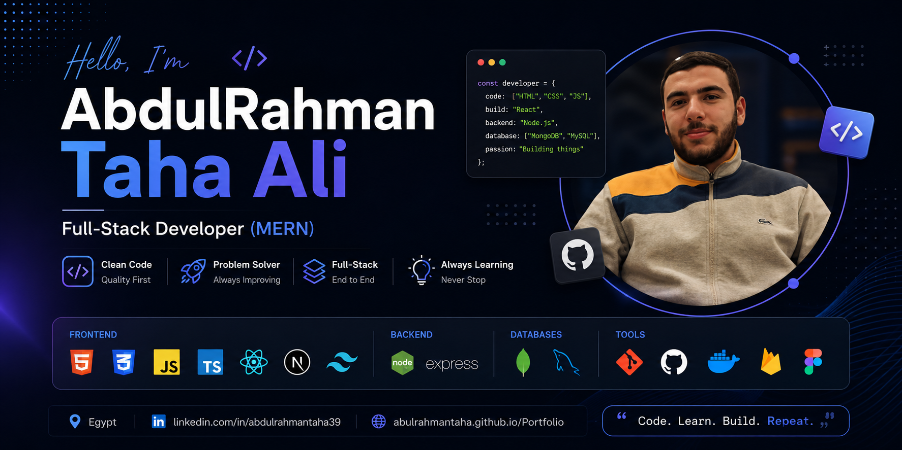

# 👋 Hi, I'm AbdulRahman Taha

<p align="center">
  
</p>

<h3 align="center">
🚀 Full-Stack Developer (MERN) | Engineering Student | DEPI Trainee
</h3>

<p align="center">
  
</p>

---

## 👨‍💻 About Me

```javascript
const AbdulRahman = {
  role: "Full-Stack Developer (MERN)",
  education: "Faculty of Engineering - Systems & Computers",
  status: "Final Year Student",
  internship: "DEPI Trainee",

  currentlyLearning: [
    "Next.js",
    "TypeScript",
    "Docker",
    "System Design",
    "Problem Solving"
  ],

  technologies: {
    frontend: [
      "HTML",
      "CSS",
      "JavaScript",
      "TypeScript",
      "React",
      "Next.js",
      "Tailwind CSS"
    ],

    backend: [
      "Node.js",
      "Express.js"
    ],

    databases: [
      "MongoDB",
      "MySQL"
    ],

    tools: [
      "Git",
      "GitHub",
      "Docker",
      "Firebase",
      "Figma"
    ]
  }
};
```

---

## 🌐 Connect With Me

<p align="left">
  <a href="https://www.linkedin.com/in/abdulrahmantaha39">
    
  </a>

  <a href="https://abulrahmantaha.github.io/Portfolio/">
    
  </a>
</p>

---

## 🚀 Tech Stack

### Frontend

<p>

</p>

### Backend

<p>

</p>

### Databases

<p>

</p>

### Tools

<p>

</p>

---

## 🌱 Currently Learning

* Next.js
* TypeScript
* Docker
* Data Structures & Algorithms
* System Design
* Problem Solving

---

## 📌 Featured Projects

### 🔥 Queueing System Simulator

JavaScript implementation of Queueing Models (MM1 & MM1K).

### 🌐 Personal Portfolio

Responsive portfolio website built using HTML, CSS and JavaScript.

### 🎓 DEPI Final Project

Project completed during DEPI training.

### 🛒 Marketplace Project

Building a scalable MERN marketplace platform.

---

## 📊 GitHub Stats

<p align="center">

</p>

<p align="center">

</p>

---

## 🏆 GitHub Trophies

<p align="center">

</p>

---

## 🎯 2026 Goals

* 🚀 Build Production MERN Applications
* 🌟 Contribute to Open Source
* 📚 Master Next.js
* 🧠 Improve Problem Solving
* 🐳 Learn Docker
* 💼 Land a Software Engineering Internship

---

## ⚡ Fun Facts

* 🤖 Interested in Robotics & Embedded Systems
* 💡 Passionate about Web Development
* 📚 Love Learning New Technologies
* 🎯 Dreaming of Building Products Used By Millions

---

<p align="center">
⭐ Thanks for visiting my profile ⭐
</p>
